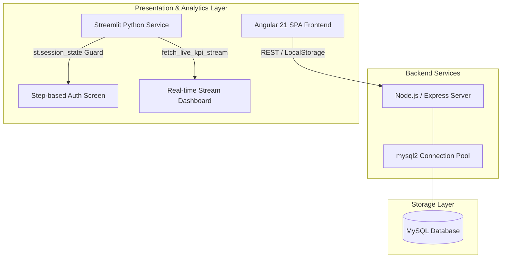
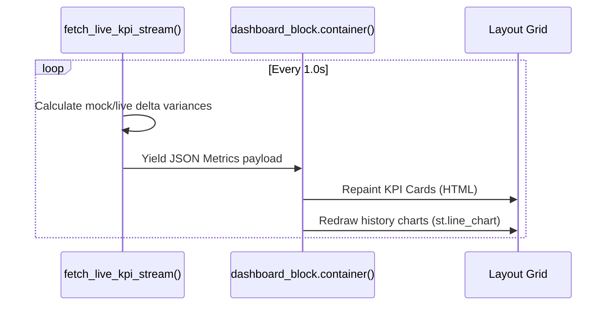

# KPI Insight — Enterprise Analytics Dashboard

KPI Insight is a modern, high-performance metrics monitoring and visualization platform. The project provides an interactive Angular-based single-page application (SPA) frontend alongside a real-time Streamlit Python dashboard.

This document details the architectural layout, core systems, and runtime instructions of the application using industry-standard systems engineering terminology.

---

## 🏛️ System Architecture



---

## 🔐 Multi-Step Dark-Themed Authentication Layout

The authentication system is split across two environments (Angular SPA and Streamlit Analytics Service) utilizing a matching premium dark-themed layout:
- **Primary Canvas Background**: `#0b0f19` (Deep Obsidian Blue)
- **Container / Card Background**: `#121826` (Premium Slate Grey)

### A. Angular SPA Client (`Login` Component)
Implemented inside [login.ts](file:///c:/Users/DELL/OneDrive/Desktop/JUNE/kpi-insight/src/app/components/login/login.ts), [login.html](file:///c:/Users/DELL/OneDrive/Desktop/JUNE/kpi-insight/src/app/components/login/login.html), and [login.css](file:///c:/Users/DELL/OneDrive/Desktop/JUNE/kpi-insight/src/app/components/login/login.css):
- **Reactive Validation**: Leverages Angular `FormGroup` with validation rules distributed across Step 1 (Company Details: Name and ID/CIN) and Step 2 (User details & minimum 8-character password).
- **Session Restoration**: Synchronizes transient form changes via `sessionStorage` on input value changes, protecting state consistency from unintended user refreshes.
- **Visual Responsiveness**: Implements custom CSS step sliding transitions (`transform: translateX()`), applying defensive `max-height` boundary styles (`310px` and `500px`) to prevent page jump and vertical truncation of validation errors.

### B. Streamlit Service (`app.py`)
Implemented inside [app.py](file:///c:/Users/DELL/OneDrive/Desktop/JUNE/app.py):
- **State Guarding**: Access to analytics modules is strictly isolated using Streamlit's `st.session_state.logged_in` sentinel flags. Unauthenticated requests are immediately diverted to the multi-step login form.
- **State Preservation**: Retains step context and fields within `st.session_state` fields (`st.session_state.login_step`, `st.session_state.company_name`, etc.) to prevent inputs resetting during Streamlit's run reruns.

---

## 🔌 Real-Time Database Connection Pooling Structure

Database resource efficiency is handled via client-side connection pooling implemented in the Express backend wrapper ([db.js](file:///c:/Users/DELL/OneDrive/Desktop/JUNE/kpi-insight/kpi-insight-backend/db.js)) using the `mysql2` client library.

### Configuration Properties:
- **`connectionLimit` (10)**: Places a cap on the maximum concurrent active database connections to avoid exhausting MySQL database thread allocations.
- **`waitForConnections` (true)**: When active connections are saturated, queries are queued instead of generating execution errors.
- **`queueLimit` (0)**: Sets an unlimited buffer size for incoming requests, allowing the pooling mechanism to handle heavy workloads gracefully.
- **`enableKeepAlive` (true)**: Injects TCP keep-alive packets at a `10000ms` delay to prevent connection termination by intermediate firewalls during idle periods.

---

## 📊 Streaming Visualization Architecture

Real-time streaming monitoring is powered by a high-throughput reactive polling system.



### Data Pipeline Mechanics:
1. **Source Generator (`fetch_live_kpi_stream()`)**: A Python generator yielding computed KPI deltas (Revenue, Active Users, Conversions, and Average Session length) over a `1s` timer loop.
2. **Mounting Container (`dashboard_block = st.empty()`)**: Reserves a dynamic DOM viewport in the Streamlit container.
3. **LoopRepaint Context**: On each loop iteration, the `st.empty` slot mounts a fresh `container()`, rendering the metric payload via raw CSS glassmorphic widgets and native charts, optimizing memory space.

---

## 🚀 Execution & Setup

### Prerequisites
- Node.js (v18+)
- Python (3.10+) with Streamlit

### Run Angular SPA Frontend
```bash
cd kpi-insight
npm install
ng serve
```
*Port mapping: http://localhost:4200*

### Run Express Backend
```bash
cd kpi-insight/kpi-insight-backend
npm install
node db.js
```

### Run Streamlit Analytics Dashboard
```bash
cd june
pip install streamlit
streamlit run app.py
```
*Port mapping: http://localhost:8501*
